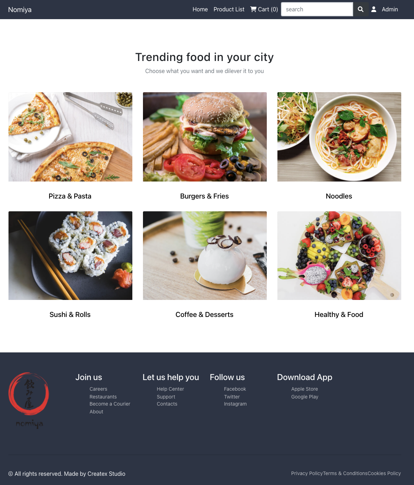
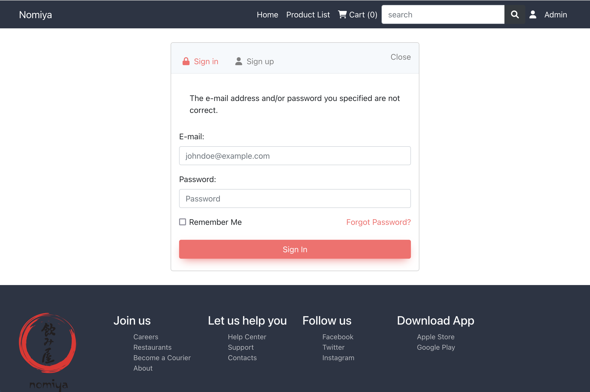

## Running this project:


Install the project dependencies with 


```
pip install -r requirements.txt
```

```
python manage.py makemigrations
```

```
python manage.py migrate
```

Create superuser

```
python manage.py createsuperuser
```
Enter the Username of your choice and press enter

```
Username: admin
```

Enter the Email address and press enter.(It can be left blank)

```
Email address:
```

Enter password:

```
Password: test
```

Run the project with command

```
python manage.py runserver
```

## URLS

Index page http://127.0.0.1:8000/products/

Product_list http://127.0.0.1:8000/products/product_list

Product_details: http://127.0.0.1:8000/products/product.id e.g. http://127.0.0.1:8000/products/2 # modify front_end

Cart summary page: http://127.0.0.1:8000/cart/

Admin  http://127.0.0.1:8000/admin/

Register http://127.0.0.1:8000/products/register


#Search function:


If search keyword is product.name or product.code (e.g. piz002, piz003, piz004...), the result will return sorted product name(s) and product price(s), then if search keyword is category, it will return category name

Frontend

Inspired by  Createx Studio 's bootstrap template


#to do list

1. override authentication templates and frontend

https://django-allauth.readthedocs.io/en/latest/templates.html


2. Product_list database rebuild